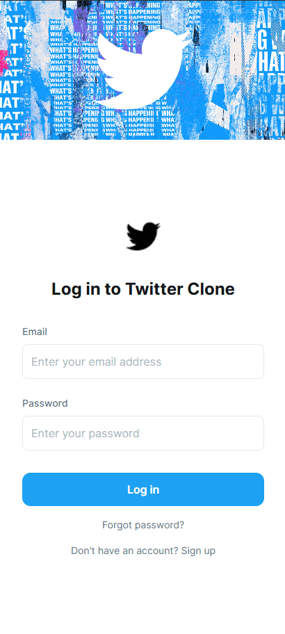
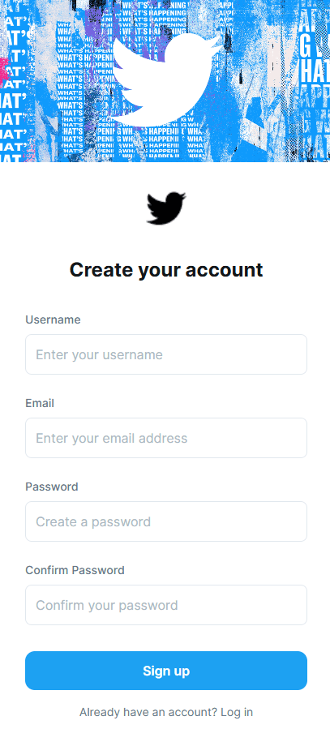
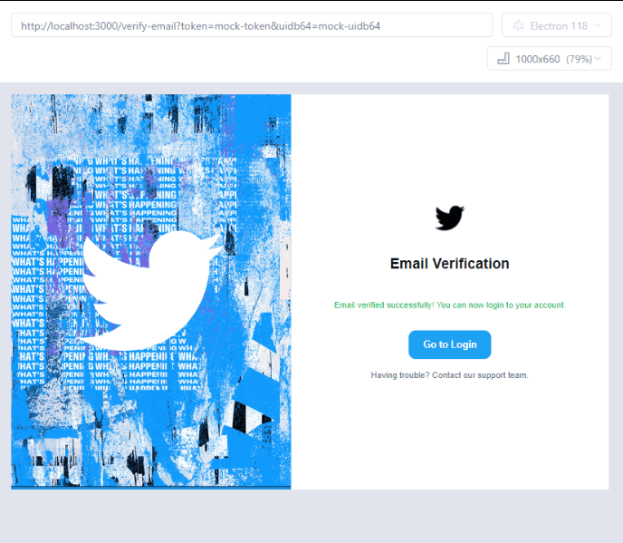
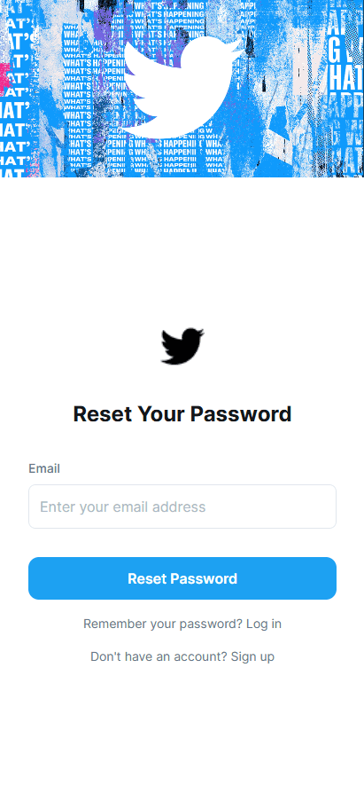
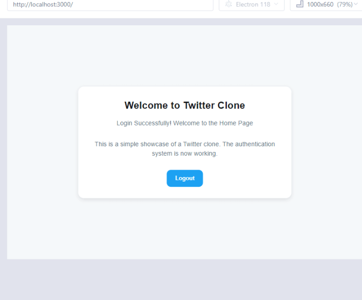

# Twitter Clone **[Under Development]**

## Overview
This Showcase is a Twitter clone that implements core functionalities such as user authentication, tweet management, and notifications. The application is built using Django for the backend and React for the frontend, providing a seamless user experience.

## Features
- User authentication with JWT
- Registration and login functionality
- Password reset and email verification
- Tweet creation, deletion, and interaction
- Real-time notifications
- Responsive design

## Tech Stack
- **Frontend**: React, TypeScript, styled-components
- **Backend**: Django, Django REST Framework, PostgreSQL
- **Testing**: Jest, Cypress for frontend; pytest for backend
- **Deployment**: Docker, (PythonAnywhere under development)

## Core Technologies
- **Django**: For building the backend API.
- **React**: For building the user interface.
- **PostgreSQL**: As the database for storing user and tweet data.
- **JWT**: For secure user authentication.

## Architecture
The application follows a client-server architecture where the frontend communicates with the backend API to perform various operations. The backend handles data processing and business logic, while the frontend provides a user-friendly interface.

### Components
- **Frontend**: Contains all React components, services, and pages.
- **Backend**: Contains Django models, views, and serializers.

## Testing Strategy
- **Unit Testing**: Comprehensive unit tests for models and authentication logic using pytest.
- **Integration Testing**: Tests for API endpoints and authentication flows.
- **End-to-End Testing**: Cypress tests for user interactions and flows.

## Project Demo

#

#

#

#

#

## Deployment Infrastructure
The application is deployed using Docker, ensuring a consistent environment across development and production. The backend is hosted on PythonAnywhere.

## Workflow
1. Clone the repository:
   ```bash
   git clone https://github.com/maxh33/showcase-twitter-clone.git
   cd showcase-twitter-clone
   ```

2. Set up the backend:
   - Navigate to the `backend` directory.
   - Install dependencies using Poetry:
     ```bash
     poetry install
     ```

3. Set up the frontend:
   - Navigate to the `frontend` directory.
   - Install dependencies using npm:
     ```bash
     npm install
     ```

4. Run the application:
   - Start the backend server:
     ```bash
     poetry run python manage.py runserver
     ```
   - Start the frontend development server:
     ```bash
     npm start
     ```

## How to Run
- Ensure you have Docker installed for local development.
- Use the provided `.env` files for environment variables.
- Follow the setup instructions above to run both the backend and frontend servers.
